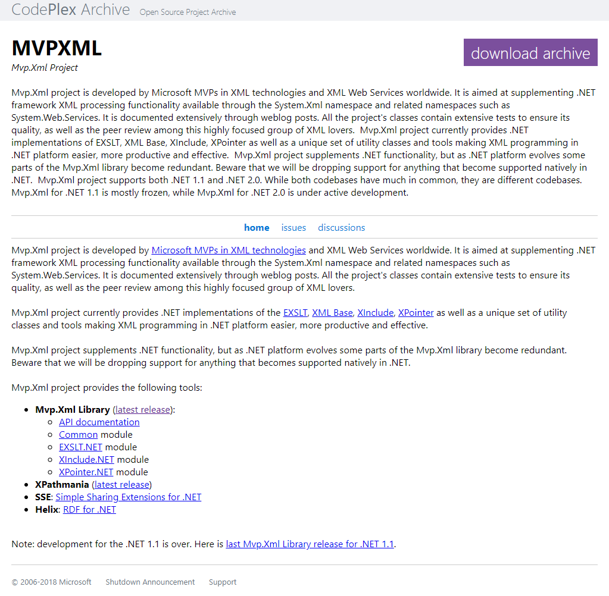

# Mvp.Xml.NetStandard
A .NET Standard port of the [Mvp.Xml project](https://archive.codeplex.com/?p=mvpxml) developed by Microsoft MVP's in XML technologies and XML Web Services worldwide.

[](https://archive.codeplex.com/?p=mvpxml)

[](https://www.myget.org/)

## Getting Started ##
Install [Nuget](https://www.nuget.org/packages/Usenet) package:
```
PM> Install-Package Mvp.Xml.NetStandard
```

## Developers
The Mvp.Xml.dll contains methods names that are not valid in c# like
for example "day-in-year". These methods are created by disassembling the dll,
renaming the methods in the il file and compiling back to dll (ildasm/ilasm round trip).

Use create-buildtools.bat to set up ildasm, ilasm and the MethodRenamer tool.

Unfortunately the symbol file (pdb) does not survive this process because of [coreclr issue #2982](https://github.com/dotnet/coreclr/issues/2982).
I will fix this as soon as pdb support is added to ilasm.

## Motivation ##
I needed the XIncludingReader in a .NET core project.

## Release Notes ##
### Release 1.0.0 ###
- Mvp.Xml library targeting .NET Standard 2.0
